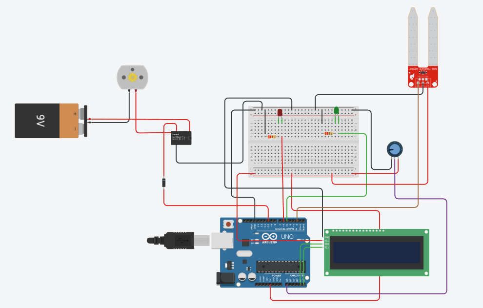

# Irrigação Automatizada

## Sobre
Esse é o meu projeto de extensão da disciplina de Programação de MicroControladores e consistiu em criar um circuito de irrigação automatizada, para auxiliar no processo de irrigação de uma plantação. Esse circuito abrangeu uma gama de componentes, como Arduino, LEDs, resistores, potenciômetro, relé, bomba d'água, sensor de umidade e display LCD.

### Como funciona

Tudo começa com um recipiente de água, que precisa estar cheio para o circuito funcionar. Dentro desse recipiente, há uma bomba d'água conectada a um relé, que está ligado ao Arduino. Também temos um sensor de umidade que deve ser inserido na terra, responsável por captar a umidade. Além disso, um potenciômetro permite que o usuário regule o nível de umidade desejado para ativar a bomba.

Quando a umidade captada pelo sensor estiver abaixo do nível definido pelo usuário, a bomba é acionada. Durante esse processo, o circuito aguarda cerca de 10 segundos antes de verificar a umidade novamente.

O display LCD fornece algumas informações ao usuário, exibindo a umidade do solo em tempo real, o nível de umidade definido ao ajustar o potenciômetro, o status de quando a bomba é acionada e também indica quando o acionamento da bomba foi concluído.

Trabalhando em conjunto com o display, há dois LEDs: um vermelho e um verde. Quando a terra está úmida, o LED verde acende e o vermelho apaga. Quando a umidade está abaixo do nível especificado, ocorre o oposto: o LED vermelho acende e o verde apaga.

O diagrama abaixo representa o circuito montado no Tinkercad. É importante ressaltar que, neste circuito, tive que improvisar um motor CC no lugar da bomba d'água, pois o Tinkercad não possui a bomba d'água no simulador.

Em relação ao código, procurei simplificar algumas partes, adotando o paradigma estruturado e seguindo boas práticas de programação. Isso inclui atribuir nomes descritivos a cada variável e função, além de adicionar comentários para garantir uma boa legibilidade.

Neste repositório, há dois sketches deste projeto. A versão de teste foi utilizada no TinkerCad e utiliza uma variável em vez do sensor de umidade, que é incrementada a cada execução. Essa abordagem permite testar todo o circuito e permite simular a variação de umidade. O outro sketch, chamado 'Principal', utiliza um sensor de umidade em vez da variável.

## Execução
Se você deseja testar o circuito, fique à vontade. Basta clicar no link a seguir: https://www.tinkercad.com/things/8vb91eYxB9M-projeto-de-extensao-pm

# Autor

Airthon Santos

https://www.linkedin.com/in/airthonsantos/